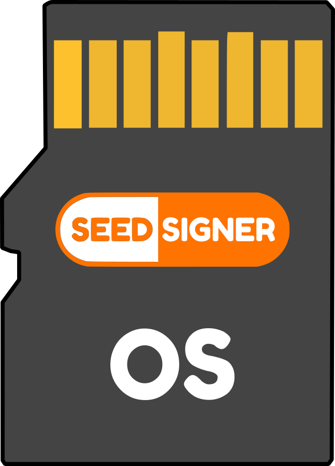

<p align="center">
  <a href="https://seedsigner.com/">
    
  </a>
</p>
<h1 align="center">SeedSigner OS</h1>

<p align="center">
  <a href="https://opensource.org/licenses/MIT" title="License: MIT">
    
  </a>
  <a href="" title="Twitter">
  
  </a>
</p>


# ✅ About

A custom linux based operating system built to manage software running on airgapped Bitcoin signing device. SeedSigner is both the project name and [application](http://github.com/SeedSigner/seedsigner/) running on airgapped hardware. This custom operating system, like all operating systems, manages the hardware resources and provides them to the application code. It's currently designed to run on common Raspberry Pi hardware with [accessories](https://github.com/SeedSigner/seedsigner/#shopping-list). The goal of SeedSigner OS is to provide an easy, fast, and secure way to build microSD card image to securely run [SeedSigner](https://seedsigner.com) code.


## ⚙️ Under the Hood

SeedSigner OS is built using [Buildroot](https://www.buildroot.org). Buildroot is a simple, efficient and easy-to-use tool to generate embedded Linux systems through cross-compilation. SeedSigner OS does not fork Buildroot, but uses Buildroot with custom configurations to build microSD card images tailor made for running SeedSigner.


## 🛂 Security

SeedSigner OS is built to reduce the attack surface area and enable additional application functionality. The OS is an order of magnatude smaller in size than Raspberry Pi OS (which is what typically is used to run software on a Pi device). Here are a list of some security and functional advantages of using SeedSigner OS.

- Boots 100% from RAM. This means, once you see the SeedSigner splash screen, you can remove the microSD card because no disk I/O is needed after boot!
- One FAT32 partition on the microSD card
- Removes these standard Raspberry Pi OS Kernel modules:
   - Networking and Bluetooth
   - SWAP
   - I2C
   - Serial
   - USB
   - Pulse-Width Modulation (PWM)
- NO HDMI support
- NO Serial connection TTL support
- NO Software supporting any wireless or networking chips
- A single read only zImage file on the boot partition containing the entire Linux kernel and filesystem


# 🛠 Building

## 🐳 Using Docker

Easiest way to build SeedSigner OS is using docker. This keeps the build process repeatable and the build system clean.

### Build Dependencies

* [Docker Compose](https://docs.docker.com/compose/install/)
* [Docker](https://docs.docker.com/get-docker/)

### Steps to build using docker compose

1. Clone the repository in your machine:
Do this with a recursive clone to pull the buildroot submodule at the same time. By default, this will create a directory in the current working directory named seedsigner-os.
   ```bash
   git clone --recursive https://github.com/SeedSigner/seedsigner-os.git
   ```
3. Go into the repo directory:
   ```bash
   cd seedsigner-os
   ```
4. Build the images using docker compose (expect this to take more than 1 hour). It *will* require 20-30 GB of disk space. You can change the `--pi0` option to the board type you wish to build or use `--all` to build all images types. The `export DOCKER_DEFAULT_PLATFORM=linux/amd64` is required to make the build reproducible. If you leave out this option on a ARM64 mac it will build faster. The `--force-recreate` and `--build` options are specified to make sure the latest image and container are used (not a local one cached).
   ```bash
   export DOCKER_DEFAULT_PLATFORM=linux/amd64
   SS_ARGS="--pi0" docker compose up --force-recreate --build
   ```

This command will build a docker image from the Dockerfile and in the background (as a daemon) run a container used to compile SeedSigner OS. You can monitor the seedsigner-os-build-images container in Docker Dashboard (if using Docker Desktop) or by running the docker container list command while waiting for the container to complete with an Exit (0) status. The container will create the image(s) in the images directory.

  ```bash
  docker container list --all
  ```

Run ```SS_ARGS="--help" docker compose up``` to see the possible build options you can pass in via the SS_ARGS env variable.

### Image Location and Naming

By default, the docker-compose.yml is configured to create a container volume of the *images* directory in the repo. This is where all the image files are written out after the container completes building the OS from source. That volume is accessible from the host. The image files are named using this convention:

`seedsigner_os.<app_repo_branch>.<board_config>.img`

Example name for a pi0 built off the 0.5.2 branch would be named:

`seedsigner_os.0.5.2.pi0.img`

Here is a table of Raspberry Pi boards to image filenames/configs

| Board                 | Image Name                        | Build Script Option |
| --------------------- | --------------------------------- | ------------------- |
|Raspberry Pi Zero      |`seedsigner_os.<tag>.pi0.img`      | --pi0               |
|Raspberry Pi Zero W    |`seedsigner_os.<tag>.pi0.img`      | --pi0               |
|Raspberry Pi 2 Model B |`seedsigner_os.<tag>.pi2.img`      | --pi2               |
|Raspberry Pi Zero 2 W  |`seedsigner_os.<tag>.pi02w.img`    | --pi02w             |
|Raspberry Pi 3 Model B |`seedsigner_os.<tag>.pi02w.img`    | --pi02w             |
|Raspberry Pi 4 Model B |`seedsigner_os.<tag>.pi4.img`      | --pi4               |

### Development cycle using docker

Each time the `docker compose up` command runs, a full build from scratch is performed. You can optionally run `docker compose up -d` in detached mode by adding the `-d` flag. This will run the container in the background. To have faster development cycles you'll likely want to avoid building the OS from scratch each time. To avoid recreating the docker image/container each time, you have a few different routes. One such route is to pass the options `--no-op` (which is the default) to the `SS_ARGS` env variable when running `docker-compose up`. This will cause the container to skip the build steps but keep the container running in the background until you explicitly stop it. You can then launch a shell session into the container and work interactively, running any specific build commands you desire.

Using docker compose will start the container (create new container if one does not already exist) without building an image
```bash
SS_ARGS="--no-op" docker compose up -d --no-recreate
```

If you want to start a new container environment, use `--force-recreate` instead of `--no-create`
```bash
SS_ARGS="--no-op" docker compose up -d --force-recreate --build
```

Start a shell session inside the container by running
```bash
docker exec -it seedsigner-os-build-images-1 bash
```

Once you are in the container you can use the build script directly from the `/opt` directory
```bash
./build.sh --pi0 --app-repo=https://github.com/seedsigner/seedsigner.git --app-branch=dev --no-clean
```

or

```bash
./build.sh --pi0 --app-repo=https://github.com/seedsigner/seedsigner.git --app-commit-id=9c36f5c --no-clean
```

Or you can use any of the Buildroot customization commands like `make menuconfig` or `linux-menuconfig`  from the `/output` directory

Move images manually built with `make` with the command `mv images/seedsigner_os.img /images/`

## Development Configs

Each board also has a developer configuration (dev config). Inside the `/opt` folder are all the build configs for each board matching the name of the build script option. The dev configs are built to work on each board but enable many of the kernel and OS features needed for development. This also makes the built image less secure, so please do not use those with real funds. Dev configs are only used when the `--dev` option is passed in to the build.sh script.

## 📑 Using Debian/Ubuntu (without docker)

If you are not using the docker image, then these build tools will be required for cross-compiling with Buildroot. This is only tested and expected to work on a debian based OS using apt package manager (not MacOS). This single command will install required dependencies for a debian based linux os.

```bash
sudo apt update && sudo apt install make binutils build-essential gcc g++ patch gzip bzip2 perl tar cpio unzip rsync file bc libssl-dev
```

Then to build to image(s), run the build script passing in the desired options

```bash
cd opt
./build.sh --pi0
```

You can see the different build options with `./build.sh --help`

## Customizing buildroot configurations

See the Buildroot [quick start guide](https://www.buildroot.org/downloads/manual/manual.html#_buildroot_quick_start) first

### Common Buildroot customization commands:

Buildroot:
```bash
make menuconfig
```

Linux Kernel:
```bash
make linux-menuconfig
```

Busybox:
```bash
busybox-menuconfig
```

## SeedSignerOS Layers

Kernel and User space are all built from scratch.


1. First layer is the hardware. Normally this is the Raspberry Pi board, camera, LCD Waveshare HAT, and microSD card.
2. Second layer is the linux kernel. Using Buildroot, only specific and minimum required modules have been hand selected to use in the kernel. This layer is required to make use of hardware functionality.
3. Third layer is user space. This is where all the libraries and applications reside. The SeedSigner application lives in this space. This is also where libraries typically live to do networking, display drivers, external port communications, etc. However on SeedSignerOS, none of these drivers or libraries are loaded (that are typically found in a linux OS).

## How is the .iso structured?


The zImage a compressed version of the Linux kernel that is self-extracting. In that compressed image, we added RootFS. The entire system in a single file!

## Boot Sequence

1. When Raspberry Pi is powered on, the bootloader starts on GPU and reads the MicroSD (SDRAM disabled at this point)
2. GPU reads bootcode.bin and starts the bootloader to enable SDRAM
3. Then start_x.elf reads config.txt, cmdline.txt and kernel
4. CPU starts working and then boots the kernel


Source: https://raspberrypi.stackexchange.com/questions/10442/what-is-the-boot-sequence
